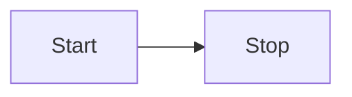

> This is the documentation for [[v3.5.0]] and lower, for documentation for **v4.0.0** and higher, see https://obsidian-html.github.io/v4


Mermaid diagram code is converted into an actual diagram in the HTML output.




Example code:

```
 \``` mermaid
  flowchart LR  
    Start --> Stop 
 \```
```
