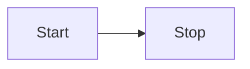

---
tags:
- type/undefined
- status/inbox
---
   
# Example Site   
   
This is an example project showing off the capabilities of [Obsidian-html](https://github.com/obsidian-html/obsidian-html).   
   
In short, this code converts Obsidian notes to proper markdown, and then spits out a site like this. [You can find the generated markdown here](https://github.com/obsidian-html/obsidian-html.github.io/tree/main/md).   
   
See also this site, which uses purely this code: [devfruits.com](https://www.devfruits.com).   
   
> All credit to this site's design goes to Andy Matuschak. I basically [stole his design](https://notes.andymatuschak.org/Evergreen_notes) because I think it is perfect.   
   
# Basics   
```
One enter
translates to
a new line, just like in Obsidian!
```
   
One enter   
translates to   
a new line, just like in Obsidian!   
   
# Links   
## Obsidian type links   
`[[Simple Obsidian-type Link]]` translates too:   
[Simple Obsidian-type Link](Resources/Example%20site/Simple%20Obsidian-type%20Link.md)   
   
Aliasing also works, `[[Simple Obsidian-type Link|Same link as before]]`:   
[Same link as before](Resources/Example%20site/Simple%20Obsidian-type%20Link.md)   
   
As does linking to chapters `[[Long long page#Chapter of interest]]`   
[Long long page#Chapter of interest](Resources/Example%20site/Long%20long%20page.md#chapter-of-interest)   
   
## Proper markdown links   
There is a setting that forces Obsidian to use proper markdown notation. So this is also supported:   
   
`[Proper markdown link](proper%20markdown)`   
[Proper markdown link](Resources/Example site/proper markdown.md)   
    
 Note that spaces must be encoded in proper markdown links.   
   
## Link awareness   
An external links show up the little icon to show it:   
[https://github.com/obsidian-html/obsidian-html](https://github.com/obsidian-html/obsidian-html)   
   
When linking to new notes, and not creating them, the link will be replaced with "not_created.html", and the link will be color coded by adding `class="nonexistent-link"` to the a href:   
   
[In the end I never created this note](/not_created.md)   
   
## Link to non-markdown files   
Image files and other non-markdown files local to the given root folder get copied over to the output. Take for example: [test textfile](textfile.txt).   
   
Note that Obsidian type links will always be appended with .md if this is missing.    
   
This is the default behavior of Obsidian. You can work around this, but when you do, it is impossible to determine with 100% certainty which file is linked to.    
   
If you want to link to files that are not markdown, use proper markdown links:   
```
[[textfile.txt]] --> [textfile.txt](textfile.txt.md)
[textfile.txt](textfile.txt) --> [textfile.txt](textfile.txt)
```
   
   
# Images   
## Obsidian type image links    
`![[Resources/img/obsidian-html-logo-sq.png]]`   
   
   
## Proper markdown image links   
``   
   
   
# Code blocks   
This is built into python-markdown, and enabled by default.   
Any codeblock or codeline is excempt from modification because they get cut out of the markdown code in the beginning, and then reinserted right before the html is created.   
[Code block examples](Resources/Example%20site/Code%20block%20examples.md)   
   
# Lists   
No newline is needed in between paragraphs and lists. This is standard in Obsidian. The fix is implemented by adding in the newline for the generated markdown.   
   
``` md
Textblock
- List item
```
   
   
Is converted to:   
``` md
Textblock

- List item
```
   
   
_Example_:    
Textblock   
   
- List item   
   
# Code inclusions   
Code inclusion in Obsidian allows you to include a note into another note, or just a part of a note in another note.    
   
It uses the same link syntax as images:   
```
![[my note]]
![[my note#only this chapter]]
```
   
   
In Obsidian, included content is denoted with a differently colored background. But since we first convert Obsidian notes to markdown, and markdown does not have this capability, we can only include the content inline, so it is not visible that the content comes from another page.   
   
## Full page inclusion   
First take a look at what content is in this page: [Test Inclusion](Resources/Example%20site/Test%20Inclusion.md).    
   
This will be included below by writing    
`![[Test Inclusion]]`. To make it clear where the included content begins and ends, we will write:   
``` md
**---begin inclusion---**
![[Test Inclusion]]
**---end inclusion---**
```
   
   
**---begin inclusion---**   
   
## Test Inclusion   
> Content
   
**---end inclusion---**   
   
## Partial code inclusion   
With partial code inclusion, we can reference a header, and then only that header and the content of that header is included. The content is read until the first header of the same level (h1 --> h1, h2 --> h2, etc), or lower level, is found. So, including a h1 header that has h2 header under it, will include those headers and their content too.   
   
First take a look at what content is in this page: [Test inclusion 2](Resources/Example%20site/Test%20inclusion%202.md).   
   
Let's say that we only want the second (h2) chapter included.    
This can be done by writing    
`![[Test inclusion 2#Second chapter]]`. To make it clear where the included content begins and ends, we will write:   
``` md
**---begin inclusion---**
![[Test inclusion 2#Second chapter]]
**---end inclusion---**
---
```
   
   
**---begin inclusion---**   
## Second chapter   
Content second chapter   
   
### An h3   
This is still a child of `Second chapter`   
   
   
**---end inclusion---**   
   
# Mermaid   

   
   
# Html tweaks   
Quite some work has been put into the usability of the html website interface. Though if you don't like it, simply change `src/template.html` out for something more basic - or more fancy.   
   
## Header links   
Hover over any header to see a chain link icon. Clicking on this will send you to the page and scroll to the header location.   
   
## Click-backs   
When you open a whole chain of notes, you'll be scrolled rightward to keep up.    
Clicking on a click-back corner will align that note with the left of the screen. This allows you to move back/forward one note at a time.    
   
Of course, the scrollbar and arrow keys are available too as methods of navigation.   
   
The clickbacks are in the top right corner of every note:   
   
   
## Closing tabs   
When you click on a new link in an earlier tab, all the open tabs after it will be closed.   
   
## Notice the url   
There is a `?path=` part in the link that allows you to open the same set of tabs after a refresh.